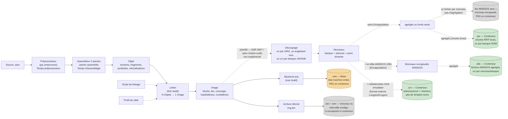

# fantams

A small Z80 assembler with a **full preprocessor** and a **source formatter**,
targeting Amstrad CPC `.sna` snapshots and raw binaries. Written in portable
C++17, it builds as a native CLI or as a WebAssembly module that runs in a
browser.

```bash
make fantams                          # native CLI
./fantams game.asm -o game.sna        # assemble to a CPC snapshot
./fantams game.asm -E -o game.pp.asm  # see what the preprocessor produced
./fantams game.asm --beautify -o game.asm
```

---

## What it does that most Z80 assemblers don't

**A real preprocessor, and you can read its output.** Macros, `repeat` / `while`
/ `for`, `if` / `elseif`, `struct`, `module`, `include`, per-expansion label
scoping — and `-E`, which writes the **unrolled source**: every macro expanded,
every loop unrolled, every include inserted, every scoped label renamed. It is
plain assembly you can read, diff, and re-assemble. When a macro misbehaves you
look at what it actually generated instead of guessing.

**A formatter with no options to argue about.** `--beautify` puts labels in
column 1, indents block bodies one step, detaches `label: instruction`, and adds
call parentheses to the macros it knows. Nothing is configurable and no
formatting directive exists in the source, so two people's files come out the
same.

**Snapshot output that survives firmware calls.** `--base` lays the assembled
bytes onto a captured post-boot machine state, so `call &BB5A` works instead of
jumping into zeros.

**Mistakes caught at assembly time.** `section name, "type"` says what a block of
source *is* — code, data, or reserved space — and that is enough to refuse a
write into a `"ro"` section, a section that outgrows its declared maximum, a jump
table that outgrows its `assert_size`, and a byte emitted into reserved space.
Three of those normally wait for a link step; here they are caught where they are
written.

**Separate assembly.** `fantams a.asm -o a.fo` assembles one unit into an object;
`fantams a.fo b.fo -o prog.bin` links them. A section without an `org` of its own
is placed by the linker, `public` and `extern` carry names across units, and
`high()` / `low()` give the two bytes of an address nobody knows yet. Two units
assembled separately and linked produce a binary **identical byte for byte** to
the same program written in one file — `examples/separate_*.asm` is that proof,
and `tests/accept_separate.sh` checks it.

The `.fo` is **text**: a wrong object is read by eye, and writing it, reading it
back and writing it again gives the same file.

**Banked programs the linker places, and switches for you.** A **target profile**
describes what a machine can do — its windows, its banks, the map states it can
actually reach, and the port writes that reach them. A **link script** says what
the profile cannot know: which section goes where. Between the two, a program
larger than 64 KB is built without a single hard-coded address or switching value:

```asm
        section gfx1, "ro"          ; the source names sections, nothing else
gfx1_data:
        db 0xA1, 0x10, 0x11, 0x12
```
```
MEMORY_MAP { CONFIG ext_w1<1> { w1 { SECTION gfx1 } } }
```

The linker gives `gfx1` its bank, derives its logical address from the window,
and offers `__port_ram_ext_w1_1` / `__val_ext_w1_1` — the port and the value
that page that bank in, **computed** from the profile rather than written by hand.
Overlaps are refused with both section names, and the unused room in each bank is
printed. `examples/banked.asm` puts five sections in four banks without one `org`,
and `--dump-profile cpc6128` prints the text you would edit to describe another
machine.

**A source can place itself, if placement is a property of the program.** When
editing a link script is not an option — a source coming from another assembler,
a host that only passes a `.asm` — a section can say where it goes:

```asm
        section gfx1, "ro" IN w1 OF ext_w1<1>
```

The linker places it and still hands back the switching values, so nothing is
written twice. It couples the source to the machine, which is the trade; ADR 0030
states it, and `examples/aliased_sym.asm` is the worked example — the same
program as `examples/aliased.asm` and `examples/aliased_org.asm`, byte for byte,
by three different routes.

**A machine-readable symbol table.** `--sym` writes a CSV — one line per label
and constant, with type, owning section, logical address, storage bank, and origin
file and line
— for a disassembler or an emulator.

---

## Quick start

```bash
git clone https://github.com/sikorama/fantams
cd fantams
make            # builds the CLI and the test binaries
make test       # 7 suites, 730 assertions
```

A first source:

```asm
        org #8000
        run start

macro poke(addr,val)
        ld a,val
        ld (addr),a
end

start:
        poke(#C000,42)
        ret
```

```bash
./fantams hello.asm -o hello.sna     # snapshot
./fantams hello.asm -o hello.bin     # raw binary
./fantams hello.asm -o hello.bin -s  # ... and print the symbol table
```

The output format is chosen by the extension of `-o`: `.sna` gives a snapshot,
anything else a raw binary.

---

## The preprocessor

Everything below happens before the assembler sees a single opcode, and `-E`
shows you the result.

| Feature | |
|---|---|
| Macros | `macro name(p1,p2)` … `end`, called `name(a,b)` |
| Loops | `repeat n[,var]`, `while cond`, `for var = low to high` |
| Conditionals | `if` / `ifdef` / `ifndef`, `elseif`, `else` |
| Structures | `struct name` … `end`, instances, `sizeof(name)` |
| Namespaces | `module gfx` prefixes every label with `gfx.` |
| Inclusion | `include "file"` |
| PP variables | `LET n = 4`, substituted with `{n}`, computed with `{=n*n}` |
| Scoped labels | `@loop` is renamed once per expansion; `@@export` opts out |

### Loops

```asm
repeat 4,idx
        db idx          ; -> db 0 / db 1 / db 2 / db 3
end

for k = 1 to 4
        db {=k*k}       ; -> db 1 / db 4 / db 9 / db 16
end
```

`for` takes `to` for an inclusive bound and `until` for an exclusive one. The
bounds are written down, so there is nothing to guess.

### Macro arguments: value or text

A bare argument is the **value**, captured at the call site. An argument in
**braces** is the **text**, resolved where it is emitted. The difference is
visible:

```asm
n = 5
macro m(x)
    repeat 3
        db x            ; value -> 5, 5, 5
        db {x}          ; text  -> 5, 4, 3
        n = n - 1
    end
end
        m(n)
```

Arguments are evaluated, never pasted: `m(1+1)` in a body doing `db x*2` gives
4, not 3.

### Per-expansion labels

A label prefixed with `@` is made unique per expansion, so a macro can loop
without colliding with itself. A label without the prefix is left alone — reused
across two expansions it is a genuine duplicate symbol, and you get told.

```asm
macro wait(n)
@loop:  dec n
        jr nz,@loop
end
```

---

## Reading the preprocessor's output

```bash
./fantams src.asm -E -o src.pp.asm
```

`-E` is a first-class output, not a debug artifact: it comes out formatted, one
instruction per line, with the extended notations already canonicalized. This
source:

```asm
LET COUNT = 4
        org #8000
        run start

macro wait(n)
@loop:  dec n
        jr nz,@loop
end

start:
        ld b,{COUNT}
        wait(b)
        wait(b)

tbl:
for k = 1 to COUNT
        db {=k*k}
end
```

comes out as:

```asm
    org #8000
    run start
start:
    ld b,4
@loop__1:
    dec b
    jr nz,@loop__1
@loop__2:
    dec b
    jr nz,@loop__2
tbl:
    db 1
    db 4
    db 9
    db 16
```

---

## The formatter

```bash
./fantams src.asm --beautify -o src.asm
```

Four rules, and no way to add a fifth from the source:

1. a label alone on its line gets its colon;
2. labels sit in column 1, everything else is indented;
3. block bodies get one extra step of indentation;
4. `label: instruction` is split in two, so all opcodes align.

Before:

```asm
wait MACRO n
  dec n
  jr nz,wait
MEND
start
     ld b,4
     wait b
  repeat 3
  nop
  rend
```

After:

```asm
    MACRO wait n
        dec n
        jr nz,wait
    MEND
start:
    ld b,4
    wait(b)
    repeat 3
        nop
    rend
```

`--no-detach-labels` and `--no-indent-blocks` opt out of the last two. The
formatter never canonicalizes — `--normalize` does that, separately, and
deliberately changes the line count.

A construct it cannot read without guessing is left alone. `sprite 4,12` might
be a macro call or a label followed by a directive; if the macro is unknown, the
line comes back untouched.

---

## Snapshots and the base state

An assembler's snapshot contains the assembled bytes and nothing else. A
`call &BB5A` needs the firmware jumpblock above `&B000`, the system variables,
the RST vectors, and lower ROM enabled — all of it installed by the ROM at boot,
none of it produced by assembling.

```bash
./fantams src.asm -o out.sna --base bases/cpc6128-en.sna
```

Every address the source actually wrote wins; every other one keeps the base's
byte. The base's header is authoritative (`SP`, gate array, `I`, `IM`, CRTC,
palette) and only `PC` is patched.

To capture a base: boot the emulator, wait for `Ready`, save a **version 2**
snapshot (256-byte header plus a flat 64 K dump). The **ROM** has to match, not
just the model.

The exported `.sna` carries 64 KB if the source stays within banks 0–3, and
128 KB as soon as it writes to banks 4–7.

---

## Differences from other assemblers

* **`repeat` index starts at 0**: indexing begins at 0 (rather than 1), matching standard index arithmetic (`db idx*8`).
* **Counted loops**: provides `for k = 1 to n` (and `until` for exclusive bounds) as a native construct.
* **Parenthesized macro calls**: supports parenthesized syntax `sprite(4, 12)` alongside bare calls `sprite 4, 12`. This makes macro calls readable without prior knowledge of the symbol list (e.g., macros coming from an `include`). Bare calls trigger a single warning per macro, and `--beautify` automatically adds parentheses.
* **Universal block closure**: the `end` keyword closes any innermost block (`if`, `macro`, `repeat`), alongside standard closing keywords (`endif`, `endm`, etc.). A mismatched closing tag produces an explicit error.
* **Trigonometry in radians**: `sin` and `cos` operate on radians instead of degrees. Degree inputs require explicit conversion (`sin(a * 3.14159265 / 180)`).
* **Floating-point division**: the `/` operator performs floating-point division, while `div` is used for integer division.
* **Preprocessor output (`-E`)**: a `-E` flag is available to output the fully unrolled source code for debugging.

---

## Command line

```
fantams (file.asm | file.fo...) [-o out] [-s] [-E] [--beautify] [--normalize]
                 [--strict] [--no-detach-labels] [--no-indent-blocks]
                 [--base base.sna] [--sym[=out.sym]]
                 [--target name | -P file.prof] [-T file.ld]
fantams --dump-profile name
fantams --version
```

| Option | Effect |
|---|---|
| `-o file` | output; `.sna` selects the snapshot backend, anything else a raw binary |
| `-s` | print the symbol table |
| `-E` | write the unrolled source instead of assembling |
| `--beautify` | format only — no preprocessing, no assembling |
| `--normalize` | canonicalize without unrolling |
| `--strict` | refuse anything that is not canonical Z80 |
| `--no-detach-labels` | keep `label: instruction` on one line |
| `--no-indent-blocks` | do not indent block bodies |
| `--base f.sna` | lay the assembled bytes onto a captured machine state (`.sna` output only) |
| `--sym[=file]` | write the symbol table as CSV; the default path derives from `-o` |
| `-o out.fo` | assemble **only**, and write the object — no linking |
| `file.fo...` | link objects already assembled |
| `--target name` | a built-in target profile (`cpc6128`, …) |
| `-P file.prof` | a target profile of your own, read by the same code path |
| `-T file.ld` | the link script — which section goes where |
| `--dump-profile name` | print a built-in profile on standard output, as the parser reads it |
| `--version` | the release date and this artifact's build date, on one line, to be read |

`ppdump` is the preprocessor alone, equivalent to `-E`.

---

## Pipeline: source to output formats



Solid arrows are implemented today; dashed arrows are the target pipeline
from `docs/spec-chaine-outils.md` and ADR 0007, not yet written. A **format
de sortie** (output format) is whatever a backend can produce at the end of
this chain; only some of them are **conteneurs** (formats that aggregate
several named, encapsulated morceaux — DSK, CPR, CRO). SNA is a format de
sortie but not a conteneur: it writes onto a whole preexisting machine
**base** rather than assembling named pieces. Raw binary and a lone
AMSDOS-prefixed binary are neither: each is a single morceau delivered on
its own — encapsulated or not, it is never aggregated with siblings. DSK
aggregates the *same* AMSDOS-encapsulated morceaux instead of delivering
them loose; CPR aggregates morceaux without encapsulation (raw RIFF
chunks); CRO adds a directory tree and emulator-initialization metadata on
top (external format, Longshot/Logon System), so its backend contract needs
a path per artefact rather than a bare name. Backends also differ in shape:
`sna`/`cpr` return one `vector<uint8_t>`, while raw/AMSDOS/DSK return a set
of named artefacts (per ADR 0007).

---

## WebAssembly build

Goes through the `emscripten/emsdk` image under podman or docker, so no local
`emcc` is needed:

```bash
./build-wasm.sh                             # -> dist/fantams.mjs + fantams.wasm
FANTAMS_OUT_DIR=../myapp/wasm ./build-wasm.sh
```

The result is an ES6 module (`export default createFantams`) exposing `callMain`
and `FS`, with no auto-run — usable from Node and from a browser.
`FANTAMS_OUT_DIR` and `FANTAMS_PUB_DIR` say where to drop the two files; relative
paths resolve from the calling directory. Nothing is recompiled unless a source
is newer than the `.wasm`, and `--force` overrides that.

Two flags matter: `-fexceptions`, without which every `throw` becomes `abort()`,
and `-sSTACK_SIZE=8388608`, because the parser recurses.

The list of core sources lives in **`sources.manifest`** and nowhere else: the
`Makefile`, `CMakeLists.txt` and `build-wasm.sh` all read it. Adding a module to
the core is adding a line there, and nothing else. Two lists, only one of them
complete, is the kind of drift that gets paid for in CI — it happened here, on
the WASM source list, and went unnoticed for three stages.

---

## Tests that need something we do not build

Two tests depend on things that live outside fantams' own build. Each one
**skips** — `ctest` reports `Skipped`, loudly, and a skip is not a pass — rather
than failing when its dependency is missing.

| Test | Needs | How to give it |
|---|---|---|
| `accept_wasm_equiv` | the WASM artifact, and `node` | `./build-wasm.sh`, or `FANTAMS_WASM=/path/to/fantams.mjs` |
| `epreuve_snapshot` | AMSpiriT's window-less frontend and its ROM set | `AMSPIRIT_HEADLESS=/path/to/amspirit-lite-headless AMSPIRIT_ROMS=/path/to/ROMs` |

`accept_wasm_equiv` is the lock: the same `argv` and the same files, through the
native adapter and through the WASM adapter, must produce the same bytes. A
stale WASM artifact violates exactly that.

`epreuve_snapshot` is an **épreuve**, not a byte test: a reference case is
assembled, the snapshot is posted to the emulator, and the machine's execution
of it is observed. It has no authority over bytes — those are tested from a
hand-built image, without a machine — only over whether a real machine accepts
the artifact.

---

## Documentation

- [`docs/syntax.md`](docs/syntax.md) — the full syntax reference
- [`docs/principes.md`](docs/principes.md) — design principles
- [`docs/spec-chaine-outils.md`](docs/spec-chaine-outils.md) — the toolchain spec:
  memory model, profiles, link scripts, and the stages that build them
- [`docs/etage-b.md`](docs/etage-b.md), [`docs/etage-c1.md`](docs/etage-c1.md) —
  what each stage delivered, step by step, and what it deliberately did not
- [`docs/adr/`](docs/adr) — architecture decision records
- [`CONTEXT.md`](CONTEXT.md) — the codebase, module by module
